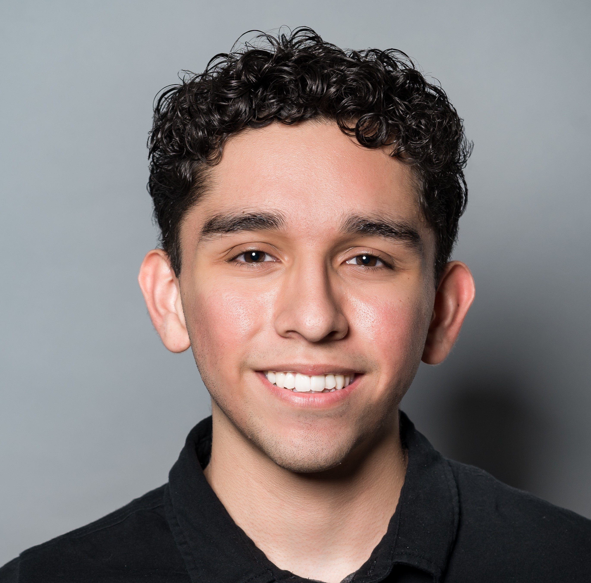

# ABOUT ME

I am a fourth-year integrated master's student looking forward to working and contributing to the field of autonomous systems. I will graduate with my BS in Computational Engineering in 2025 and my Master's in Computational Science, Engineering, and Math. Additionally, I am getting a minor in robotics. As an undergraduate, I have enjoyed doing research revolving around autonomous drones and helping others learn more about the incredible world of robotics. I am also interested in learning more and working with machine learning. 

Email: antjim19037@utexas.edu | [LinkedIn](https://www.linkedin.com/in/antonio-o-jimenez/) | [Github](https://github.com/aJimenez19037)  

# Work Experience

## Summer Honors Intern, The Applied Research Laboratories - Austin, TX (06/24 - 08/24)

*   Developed an underwater vehicle simulator that leveraged ROS2 and the Gazebo physics simulator allowing for rapid testing and development of perception, planning, and control algorithms. 
*   Explored and integrated several open-source packages, such as a physics-based sonar sensor, creating a more realistic underwater vehicle simulation.

## Undergraduate Research Assistant, Controls Group for Distributed and Uncertain Systems (CDUS) - Austin, TX (01/2023 – 05/2024)
- Adapted a lightweight Simultaneous Localization and Mapping (SLAM) algorithm from a rover to a quadcopter.
  - Developed a drone platform to be utilized for future research.
  - Conducted a trade study on hardware and software limitations necessary to run the SLAM algorithm efficiently while meeting size, weight, power, and cost constraints.
  - Developed drone control framework using the PX4 flight stack, enabling the drone to execute autonomous missions.     
  - Simulated a quadcopter within the Gazebo simulator to ensure code functionality before testing on the physical drone.

- Researched and programmed optimal task allocation algorithm for a cooperative drone inspection challenge. 
  - Utilized the Octomap library to merge maps from various drones to create a global occupation map of explored regions when in the line of sight of each other. 
- Assisted in creating a robust image pipeline involving marker detection, classification, and pose estimation. 
  - Estimated the pose of the marker based on key points ensuring a reliable approach angle.   
  - Implemented blurs, thresholds, contour detection, and other pre-processing techniques to improve the robustness of marker detection. 
  - Researched trade-offs between marker complexity and detection accuracy ensuring robust detection from higher altitudes.

# Projects

## Hurricane Harvey Classification Inference Server, Software Design for Responsible Intelligent Systems - Austin, TX (2024)  

* Designed and evaluated the performance of several artificial neural networks and convoluted neural networks to classify whether satellite images contained damaged or undamaged houses.  
* Deployed models by containerizing a Flask application using Docker allowing users to easily use the different models. 

## Pupper Leg Dot Tracking, Gateway to Robotics - Austin, TX (2023) 

* 3-D printed and built a pupper robot leg while analyzing the benefits of different printing orientations and materials.  
* Implemented inverse kinematics and computer vision algorithms using OpenCV to allow for the robot leg to follow a red dot.  

## Perseverance and Ingenuity Tracker REST API, Software Engineering and Design - Austin, TX   

* Developed a Flask application with multiple endpoints to provide online users access to mission data from both robots. 
* Employed Redis, a No-SQL database, to manage robot mission data, user generated data, and queues. 
* Integrated the Imgur API, allowing users to easily download generated plots directly from the internet. 
* Containerized the Flask app with Docker and deployed it on Kubernetes, ensuring scalability and smooth performance. 

# Leadership

## President, Texas Aerial Robotics - Austin, TX (3/2023 – 5/2024)

* Implemented strategic decisions regarding the organization’s direction and structure, resulting in improved member retention. 
* Led in organizing multi-organization social events, company talks, and workshops improving member outcomes. 
* Organized and assisted the creation of 7 workshops to familiarize members with the tools necessary for drone programming. 
* Raytheon Drone Innovation Competition – 2nd place 
* Implemented computer vision and pathing algorithms to create an autonomous drone capable of tracking and immobilizing a moving target as a part of a drone competition. 
* Integrated flight controller, companion computer, and the ground control system allowing for autonomous drone missions.  

